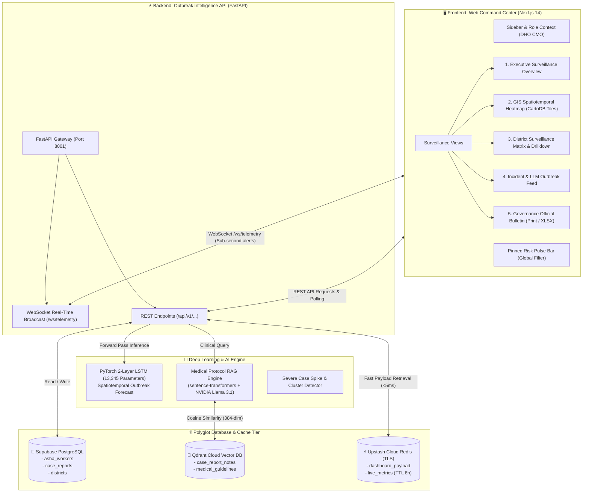
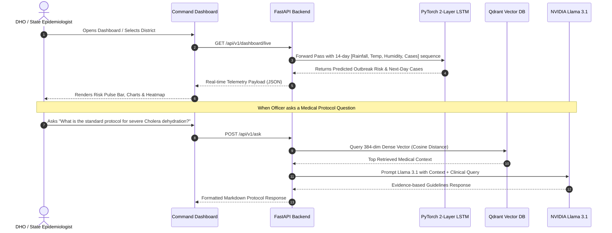

# 🛡️ Arogya Prahari — Command Dashboard (आरोग्य प्रहरी)
> *"One view, every district's risk."* • **"एक नज़र, हर ज़िले की स्थिति"**

**Arogya Prahari Command Dashboard** is a mission-critical public health surveillance and early outbreak warning platform designed for District Health Officers (DHO), State Epidemiologists, and Primary Health Centre (PHC) administrators.

The system continuously aggregates field symptom reports from frontline workers, integrates live meteorological feeds (IMD Precipitation & Humidity), executes spatiotemporal **PyTorch Recurrent LSTM Neural Networks** for 14-day outbreak trajectories, and provides instant RAG clinical guidelines retrieval via **Qdrant Vector DB** and **NVIDIA Llama 3.1 LLM**.

---

## 🏛️ System Architecture



---

## 🔬 Core Outbreak Intelligence Features

### 1. 🎛️ Signature Component: The Risk Pulse Bar
- A pinned, high-contrast horizontal distribution bar that visualizes the state-wide proportion of districts across four risk tiers:
  - **Critical Outbreak** (`#8B0000`)
  - **High Risk** (`#C6362C`)
  - **Moderate Risk** (`#E8901A`)
  - **Low / Normal** (`#146356`)
- Acts as a **global interactive filter** that immediately synchronizes all active views (Overview, Map, Matrix, and Alerts) on click.

### 2. 🗺️ GIS Spatiotemporal Heatmap & Cluster Overlay
- Centered on the **Maharashtra Surveillance Grid** (`19.2° N, 75.6° E`).
- Utilizes desaturated CartoDB base tiles to provide high optical contrast for risk color overlays.
- **Dynamic Temporal Time-Scrubber**: Slide seamlessly from **`-30 Days` (Historical Observations)** $\rightarrow$ **`Today` (Live Telemetry)** $\rightarrow$ **`+14 Days` (ML Forecast)** to track outbreak propagation.
- Displays multi-ring density heat circles with animated radar rings on High & Critical zones.

### 3. 📊 District Surveillance Matrix & Detail Drilldown
- Sortable tabular matrix with **IBM Plex Mono** tabular numerals for precise tracking of cases, 7-day trajectory deltas, and IMD rainfall.
- **District Detail Drawer**: Slide-over panel displaying AI risk probabilities, pathogen classification, demographic exposure, and PHC medical buffers (ORS, IV fluids, and bed capacity).
- **One-Click Data Exports**: Export surveillance datasets to CSV or Excel (`.xlsx`).

### 4. 🚨 Real-Time Emergency Alerts & SOS Stream
- Persistent **WebSocket connection** (`ws://localhost:8001/ws/telemetry`) receives immediate sub-second notifications from field health workers.
- **NVIDIA Llama 3.1 LLM-Generated Outbreak Briefs** automatically synthesize epidemiological anomaly notes into actionable executive summaries.

### 5. 🖨️ Government Governance Bulletin
- Printable, official government health bulletin formatted with `@media print` rules, grayscale-friendly typography, and official CMO sign-off blocks.

---

## 🧠 Deep Learning & AI Architecture



### PyTorch LSTM Model Specifications
- **Architecture**: `OutbreakForecastLSTM` (2 stacked LSTM recurrent layers + Linear projection).
- **Input Dimension**: `(Batch, 14, 4)` representing a 14-day sliding window of `[rainfall_mm, avg_temp_c, humidity_pct, daily_cases]`.
- **Hidden Layer Size**: 32 hidden units per cell.
- **Parameters**: 13,345 trainable weights.
- **Calibration**: Dynamic inverse scaling with `MinMaxScaler` and epidemiological Z-score evaluation.

---

## 🗄️ Database Architecture

| Store | Technology | Purpose | Key Entities / Collections |
| :--- | :--- | :--- | :--- |
| **Relational Master** | Supabase PostgreSQL | Master transactional source of truth | `asha_workers`, `case_reports`, `districts` |
| **Semantic Vector Store** | Qdrant Cloud (AWS EU) | 384-dim semantic embeddings (MiniLM-L6) | `case_report_notes`, `medical_guidelines` |
| **High-Speed Cache** | Upstash Redis (TLS) | Sub-millisecond dashboard payload caching | `dashboard_payload`, `live_metrics` (TTL 6h) |

---

## 🚀 Getting Started Locally

### Prerequisites
- Node.js 18+ & npm
- Python 3.10+
- PyTorch 2.0+

---

### 1. ⚙️ Backend API & ML Service Setup

```bash
# Navigate to services directory
cd services

# Create and activate Python virtual environment
python3 -m venv venv
source venv/bin/activate    # On Windows: venv\Scripts\activate

# Install Python dependencies
pip install fastapi uvicorn torch torchvision sentence-transformers qdrant-client langchain-nvidia-ai-endpoints asyncpg redis websockets pandas scikit-learn

# Start the FastAPI ML Server
cd api
uvicorn main:app --host 0.0.0.0 --port 8001 --reload
```
- **Backend API**: [http://localhost:8001](http://localhost:8001)
- **Interactive Swagger Documentation**: [http://localhost:8001/docs](http://localhost:8001/docs)

---

### 2. 🖥️ Web Command Dashboard Setup

```bash
# Navigate to web dashboard root
cd web

# Install node dependencies
npm install

# Start Next.js Development Server
npm run dev
```
- **Command Dashboard**: [http://localhost:3000](http://localhost:3000)

---

## 🎨 Design Tokens & Visual Hierarchy

The dashboard utilizes the **Arogya Prahari Sovereign Health Design System**:

| Token Name | Hex Code | Semantic Role |
| :--- | :--- | :--- |
| **Prahari Rose** | `#C2255C` | Primary brand accent, selected active states, primary CTA |
| **Sentinel Teal** | `#146356` | Verified safe state, Low risk tier, stable epidemiological trend |
| **Alert Amber** | `#E8901A` | Moderate risk tier, warning threshold, investigation required |
| **SOS Red** | `#C6362C` | High risk tier, urgent field outbreak alert |
| **Critical Maroon** | `#8B0000` | Critical outbreak risk (>0.80), immediate containment required |
| **Command Paper** | `#F6F5F2` | Ambient application background for reduced optical fatigue |
| **Ink** | `#1D2321` | High-contrast readable typography |
| **Slate** | `#5B6663` | Subtitles, timestamps, and secondary metadata |

- **Typography**: `Noto Sans` & `Noto Sans Devanagari` for clean multi-lingual UI text; `IBM Plex Mono` for tabular numerals, coordinates, and case counts.

---

## 📄 License
This project is licensed under the MIT License.
